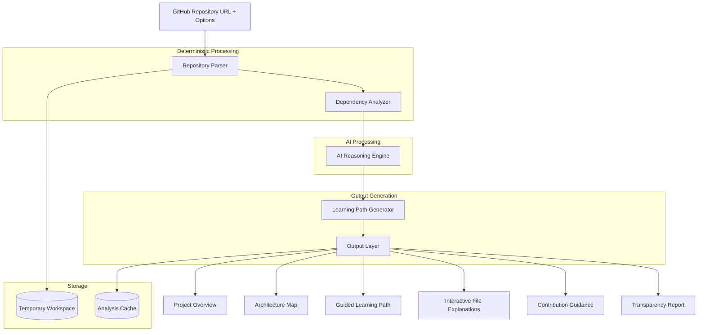
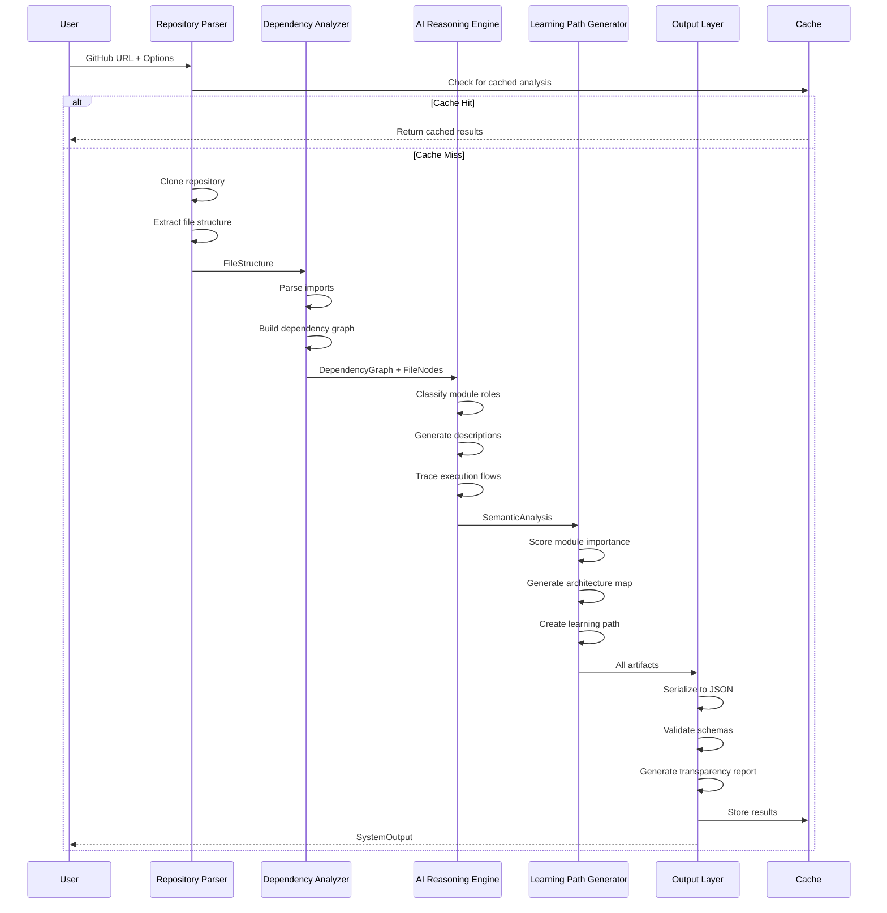

# Design Document: AI Codebase Simplifier & Interactive Onboarding Assistant

## Overview

The AI Codebase Simplifier & Interactive Onboarding Assistant is a multi-stage pipeline system that transforms GitHub repositories into structured onboarding experiences. The system combines deterministic code analysis with AI-powered semantic reasoning to produce architecture maps, guided learning paths, and interactive explanations.

The architecture follows a clear separation of concerns:
- **Deterministic Layer**: File parsing, dependency extraction, graph construction
- **AI Reasoning Layer**: Semantic analysis, natural language generation, pattern recognition
- **Output Generation Layer**: Structured artifact creation, serialization, validation

This design ensures that core analysis is reliable and reproducible, while AI enhances understanding through semantic insights.

## Architecture

The system consists of five core modules organized in a sequential pipeline:

```
GitHub URL → Repository Parser → Dependency Analyzer → AI Reasoning Engine → Learning Path Generator → Output Layer
                    ↓                    ↓                      ↓                       ↓
              File Structure      Dependency Graph      Semantic Insights      Structured Artifacts
```

### High-Level Architecture Diagram



## Components and Interfaces

### 1. Repository Parser

**Responsibility**: Clone GitHub repositories, extract file structure, detect technology stack

**Deterministic Operations**:
- URL validation using regex patterns
- Git clone operations
- File system traversal
- File type classification by extension
- Metadata extraction (size, line count, modification date)

**Inputs**:
```typescript
interface RepositoryInput {
  url: string;                    // GitHub repository URL
  skillLevel?: 'Beginner' | 'Intermediate' | 'Advanced';
  focusArea?: 'Architecture' | 'Backend' | 'Frontend' | 'Data Flow' | 'Contribution';
  timeConstraint?: number;        // Minutes available for learning
}
```

**Outputs**:
```typescript
interface FileStructure {
  files: FileNode[];
  primaryLanguage: string;
  frameworks: string[];
  buildTools: string[];
  testingFrameworks: string[];
  infrastructureTools: string[];
  metadata: RepositoryMetadata;
}

interface FileNode {
  path: string;
  type: 'source' | 'config' | 'documentation' | 'test';
  language: string;
  size: number;
  lineCount: number;
  lastModified: Date;
}

interface RepositoryMetadata {
  url: string;
  commitSHA: string;
  cloneTimestamp: Date;
  totalFiles: number;
  totalLines: number;
}
```

**Key Algorithms**:
- **Language Detection**: Count files by extension, select most frequent as primary
- **Framework Detection**: Parse manifest files (package.json, requirements.txt, pom.xml) and extract dependencies
- **Directory Exclusion**: Skip node_modules, .git, build, dist, vendor, __pycache__, .next, target

**Error Handling**:
- Invalid URL → Return `InvalidURLError` with validation details
- Clone failure → Return `CloneError` with git error message
- Repository too large (>10,000 files) → Return `RepositorySizeError`
- No code files found → Return `EmptyRepositoryError`

### 2. Dependency Analyzer

**Responsibility**: Parse import statements, construct dependency graph, identify entry points

**Deterministic Operations**:
- Import statement parsing using language-specific regex patterns
- Directed graph construction
- Cycle detection using depth-first search
- Dependency depth calculation using breadth-first search
- External dependency extraction from manifest files

**Inputs**:
```typescript
interface FileStructure {
  files: FileNode[];
  primaryLanguage: string;
}
```

**Outputs**:
```typescript
interface DependencyGraph {
  nodes: ModuleNode[];
  edges: DependencyEdge[];
  entryPointCandidates: string[];  // File paths ranked by importance
  circularDependencies: string[][];
  externalDependencies: ExternalDependency[];
}

interface ModuleNode {
  filePath: string;
  imports: string[];              // Outgoing dependencies
  importedBy: string[];           // Incoming dependencies
  dependencyDepth: number;        // Distance from entry points
  fanIn: number;                  // Number of modules importing this
  fanOut: number;                 // Number of modules this imports
}

interface DependencyEdge {
  from: string;
  to: string;
  type: 'import' | 'require' | 'include';
}

interface ExternalDependency {
  name: string;
  version: string;
  source: 'npm' | 'pip' | 'maven' | 'cargo' | 'go';
}
```

**Key Algorithms**:

1. **Import Parsing** (Language-Specific):
   - Python: `import X`, `from X import Y`
   - JavaScript/TypeScript: `import X from 'Y'`, `require('X')`
   - Java: `import X.Y.Z;`
   - Go: `import "X"`

2. **Entry Point Detection** (Deterministic Heuristics):
   - Files named: main.*, index.*, app.*, server.*, cli.*
   - Files with high fan-out (imports many modules)
   - Files in root or src/ directory
   - Framework-specific patterns (App.tsx, urls.py, server.js)

3. **Dependency Depth Calculation**:
   ```
   BFS from entry points:
   - Entry points: depth = 0
   - Direct imports: depth = 1
   - Transitive imports: depth = parent_depth + 1
   ```

4. **Cycle Detection**:
   - Run DFS with visited/visiting/visited states
   - Mark cycles when revisiting a "visiting" node

**Error Handling**:
- Parse failure for a file → Log error, continue with remaining files
- Unresolved import → Mark as external or missing dependency
- Circular dependency → Flag in output, do not fail

### 3. AI Reasoning Engine

**Responsibility**: Apply language models for semantic analysis, natural language generation, pattern recognition

**AI-Powered Operations**:
- Semantic role classification (controller, service, model, utility)
- Natural language function descriptions
- Execution flow tracing through function calls
- Code smell detection
- Contribution opportunity identification
- Confidence scoring

**Inputs**:
```typescript
interface DependencyGraph {
  nodes: ModuleNode[];
  edges: DependencyEdge[];
}

interface FileNode {
  path: string;
  content: string;  // File source code
}
```

**Outputs**:
```typescript
interface SemanticAnalysis {
  moduleRoles: Map<string, ModuleRole>;
  functionDescriptions: Map<string, FunctionDescription[]>;
  executionFlows: ExecutionFlow[];
  codeSmells: CodeSmell[];
  contributionOpportunities: ContributionOpportunity[];
}

interface ModuleRole {
  filePath: string;
  role: 'controller' | 'service' | 'model' | 'utility' | 'configuration' | 'test';
  confidence: number;  // 0.0 to 1.0
  reasoning: string;
}

interface FunctionDescription {
  name: string;
  signature: string;
  description: string;
  parameters: ParameterDescription[];
  returnValue: string;
  confidence: number;
}

interface ExecutionFlow {
  entryPoint: string;
  steps: ExecutionStep[];
  flowType: 'synchronous' | 'asynchronous' | 'event-driven';
  confidence: number;
}

interface ExecutionStep {
  filePath: string;
  functionName: string;
  description: string;
  order: number;
}

interface CodeSmell {
  filePath: string;
  type: 'long_function' | 'high_complexity' | 'duplication' | 'missing_docs';
  severity: 'low' | 'medium' | 'high';
  description: string;
  lineNumbers: number[];
}

interface ContributionOpportunity {
  filePath: string;
  type: 'refactor' | 'documentation' | 'test_coverage' | 'bug_fix';
  priority: 'low' | 'medium' | 'high';
  description: string;
  estimatedEffort: 'small' | 'medium' | 'large';
}
```

**AI Pipeline**:

1. **Module Role Classification**:
   - Input: File path, file content, imports, importedBy
   - Prompt: "Analyze this code file and classify its primary role..."
   - Output: Role label + confidence + reasoning

2. **Function Description Generation**:
   - Input: Function signature, function body, surrounding context
   - Prompt: "Explain what this function does in one sentence..."
   - Output: Natural language description

3. **Execution Flow Tracing**:
   - Input: Entry point file, dependency graph, function call chains
   - Prompt: "Trace the execution flow starting from this entry point..."
   - Output: Ordered sequence of execution steps

4. **Code Smell Detection**:
   - Input: File content, complexity metrics
   - Prompt: "Identify code quality issues in this file..."
   - Output: List of code smells with severity

5. **Contribution Opportunity Identification**:
   - Input: Code smells, test coverage, documentation gaps
   - Prompt: "Suggest low-risk improvements for this codebase..."
   - Output: Prioritized list of contribution opportunities

**Confidence Scoring**:
- Based on code clarity (presence of comments, clear naming)
- Based on pattern recognition certainty (common vs uncommon patterns)
- Based on documentation presence (README, inline docs)
- Aggregate: `confidence = (clarity_score + pattern_score + doc_score) / 3`

**Error Handling**:
- AI timeout (>30s per file) → Return partial results with warning
- AI API failure → Return deterministic analysis only, mark AI insights as unavailable
- Low confidence (<0.6) → Display warning to user

### 4. Learning Path Generator

**Responsibility**: Create ordered exploration sequences, generate architecture maps, prioritize modules

**Deterministic Operations**:
- Module prioritization based on dependency metrics
- Layer classification (presentation, business, data, utility)
- Safe starting point identification
- Path truncation based on time constraints

**Inputs**:
```typescript
interface DependencyGraph {
  nodes: ModuleNode[];
  edges: DependencyEdge[];
}

interface SemanticAnalysis {
  moduleRoles: Map<string, ModuleRole>;
}

interface RepositoryInput {
  skillLevel?: 'Beginner' | 'Intermediate' | 'Advanced';
  focusArea?: 'Architecture' | 'Backend' | 'Frontend' | 'Data Flow' | 'Contribution';
  timeConstraint?: number;
}
```

**Outputs**:
```typescript
interface ArchitectureMap {
  layers: Layer[];
  modules: ModuleInfo[];
  entryPoints: EntryPointInfo[];
  coreModules: string[];        // High fan-in modules
  leafModules: string[];        // Zero fan-out modules
  visualRepresentation: string; // Mermaid diagram
}

interface Layer {
  name: 'presentation' | 'business' | 'data' | 'utility';
  modules: string[];
}

interface ModuleInfo {
  filePath: string;
  role: string;
  importance: number;           // 0.0 to 1.0
  dependencies: string[];
  dependents: string[];
}

interface EntryPointInfo {
  filePath: string;
  context: 'CLI' | 'web_server' | 'background_job' | 'test_suite';
  rank: number;
}

interface GuidedLearningPath {
  steps: LearningStep[];
  estimatedDuration: number;    // Minutes
  skillLevel: string;
  focusArea?: string;
}

interface LearningStep {
  order: number;
  filePath: string;
  reason: string;               // Why this file is important
  safeToModify: boolean;
  prerequisites: string[];      // Files to understand first
}
```

**Key Algorithms**:

1. **Module Importance Scoring**:
   ```
   importance = (fanIn * 0.4) + (isEntryPoint * 0.3) + (roleWeight * 0.3)
   
   roleWeight:
   - controller: 0.9
   - service: 0.8
   - model: 0.7
   - utility: 0.5
   - configuration: 0.3
   ```

2. **Learning Path Generation**:
   ```
   if skillLevel == 'Beginner':
     start with entry points → high-level controllers → services → models
   elif skillLevel == 'Intermediate':
     start with services → models → utilities → entry points
   elif skillLevel == 'Advanced':
     start with core abstractions → design patterns → edge cases
   
   if focusArea specified:
     filter modules by role matching focus area
   
   if timeConstraint specified:
     truncate to top N modules where sum(estimated_time) <= timeConstraint
   ```

3. **Safe Starting Point Identification**:
   ```
   safeToModify = (
     fanIn < 3 AND                    // Few dependents
     hasTests AND                     // Test coverage exists
     role in ['utility', 'model'] AND // Stable interfaces
     NOT isEntryPoint                 // Not critical path
   )
   ```

4. **Layer Classification**:
   ```
   presentation: role == 'controller' OR path contains 'views', 'components', 'ui'
   business: role == 'service' OR path contains 'services', 'logic', 'handlers'
   data: role == 'model' OR path contains 'models', 'entities', 'repositories'
   utility: role == 'utility' OR path contains 'utils', 'helpers', 'lib'
   ```

**Error Handling**:
- No entry points found → Use highest fan-out modules as pseudo-entry points
- Time constraint too small → Return minimum viable path (top 3 modules)
- Focus area has no matching modules → Fall back to general architecture path

### 5. Output Layer

**Responsibility**: Serialize artifacts, validate schemas, generate transparency reports, manage caching

**Deterministic Operations**:
- JSON serialization
- Schema validation
- Mermaid diagram generation
- Cache management
- Workspace cleanup

**Inputs**:
```typescript
interface FileStructure { /* ... */ }
interface DependencyGraph { /* ... */ }
interface SemanticAnalysis { /* ... */ }
interface ArchitectureMap { /* ... */ }
interface GuidedLearningPath { /* ... */ }
```

**Outputs**:
```typescript
interface SystemOutput {
  projectOverview: ProjectOverview;
  architectureMap: ArchitectureMap;
  guidedLearningPath: GuidedLearningPath;
  interactiveFileExplanations: Map<string, FileExplanation>;
  contributionGuidance: ContributionGuidance;
  transparencyReport: TransparencyReport;
  metadata: OutputMetadata;
}

interface ProjectOverview {
  purpose: string;
  primaryLanguage: string;
  frameworks: string[];
  techStack: TechStack;
  repositoryStats: RepositoryStats;
}

interface TechStack {
  languages: string[];
  frameworks: string[];
  buildTools: string[];
  testingFrameworks: string[];
  infrastructureTools: string[];
}

interface RepositoryStats {
  totalFiles: number;
  totalLines: number;
  codeFiles: number;
  testFiles: number;
  configFiles: number;
}

interface FileExplanation {
  filePath: string;
  role: string;
  primaryResponsibility: string;
  keyFunctions: FunctionDescription[];
  incomingDependencies: string[];
  outgoingDependencies: string[];
  safeModificationAreas: CodeRegion[];
  criticalSections: CodeRegion[];
  confidence: number;
}

interface CodeRegion {
  startLine: number;
  endLine: number;
  description: string;
}

interface ContributionGuidance {
  opportunities: ContributionOpportunity[];
  quickWins: ContributionOpportunity[];  // High priority, low effort
  refactoringTargets: CodeSmell[];
}

interface TransparencyReport {
  processingStages: ProcessingStage[];
  filesAnalyzed: number;
  filesSkipped: number;
  filesFailed: string[];
  deterministicOperations: string[];
  aiOperations: AIOperation[];
  processingStatistics: ProcessingStats;
}

interface ProcessingStage {
  stage: string;
  status: 'completed' | 'partial' | 'failed';
  duration: number;  // Milliseconds
  details: string;
}

interface AIOperation {
  operation: string;
  modelVersion: string;
  promptTemplate: string;
  inputTokens: number;
  outputTokens: number;
  confidence: number;
}

interface ProcessingStats {
  totalDuration: number;
  cacheHit: boolean;
  memoryUsage: number;
  aiCallCount: number;
}

interface OutputMetadata {
  analysisTimestamp: Date;
  repositoryURL: string;
  commitSHA: string;
  processingDuration: number;
  systemVersion: string;
  deterministicComponents: string[];
  aiComponents: string[];
}
```

**Schema Validation**:
- Validate all outputs against JSON Schema definitions
- Fail fast if schema validation fails
- Return validation errors with field-level details

**Mermaid Diagram Generation**:
```typescript
function generateArchitectureDiagram(map: ArchitectureMap): string {
  let mermaid = "graph TB\n";
  
  // Add entry points
  for (const ep of map.entryPoints) {
    mermaid += `  ${sanitize(ep.filePath)}[${ep.context}]\n`;
  }
  
  // Add modules by layer
  for (const layer of map.layers) {
    mermaid += `  subgraph ${layer.name}\n`;
    for (const module of layer.modules) {
      mermaid += `    ${sanitize(module)}\n`;
    }
    mermaid += `  end\n`;
  }
  
  // Add dependencies
  for (const module of map.modules) {
    for (const dep of module.dependencies) {
      mermaid += `  ${sanitize(module.filePath)} --> ${sanitize(dep)}\n`;
    }
  }
  
  return mermaid;
}
```

**Caching Strategy**:
- Cache key: `SHA256(repositoryURL + commitSHA)`
- Cache TTL: 24 hours
- Cache invalidation: On new commit or manual refresh
- Cached data: Complete SystemOutput object

**Error Handling**:
- Schema validation failure → Return `ValidationError` with field details
- Serialization failure → Return `SerializationError`
- Cache write failure → Log warning, continue without caching

## Data Models

### Core Data Structures

**File System Representation**:
```typescript
class FileTree {
  root: FileNode;
  
  traverse(visitor: (node: FileNode) => void): void;
  filter(predicate: (node: FileNode) => boolean): FileNode[];
  findByPath(path: string): FileNode | null;
}
```

**Dependency Graph Representation**:
```typescript
class DependencyGraph {
  private adjacencyList: Map<string, Set<string>>;
  private reverseAdjacencyList: Map<string, Set<string>>;
  
  addEdge(from: string, to: string): void;
  getOutgoingEdges(node: string): string[];
  getIncomingEdges(node: string): string[];
  detectCycles(): string[][];
  calculateDepth(entryPoints: string[]): Map<string, number>;
  topologicalSort(): string[];
}
```

**Analysis Result Store**:
```typescript
class AnalysisStore {
  private fileStructure: FileStructure;
  private dependencyGraph: DependencyGraph;
  private semanticAnalysis: SemanticAnalysis;
  private architectureMap: ArchitectureMap;
  private learningPath: GuidedLearningPath;
  
  getFileExplanation(filePath: string): FileExplanation;
  getModulesByRole(role: string): ModuleInfo[];
  getExecutionFlow(entryPoint: string): ExecutionFlow;
}
```

## Data Flow

### End-to-End Processing Pipeline

```
1. Input Validation
   ├─ Validate GitHub URL format
   ├─ Check repository accessibility
   └─ Parse optional parameters

2. Repository Cloning (Deterministic)
   ├─ Clone to temporary workspace
   ├─ Extract commit SHA
   └─ Check cache for existing analysis

3. File Structure Extraction (Deterministic)
   ├─ Traverse directory tree
   ├─ Classify files by type
   ├─ Extract metadata
   ├─ Detect primary language
   └─ Identify frameworks and tools

4. Dependency Analysis (Deterministic)
   ├─ Parse import statements
   ├─ Construct dependency graph
   ├─ Detect cycles
   ├─ Calculate dependency depth
   ├─ Identify entry point candidates
   └─ Extract external dependencies

5. Semantic Analysis (AI-Powered)
   ├─ Classify module roles
   ├─ Generate function descriptions
   ├─ Trace execution flows
   ├─ Detect code smells
   ├─ Identify contribution opportunities
   └─ Calculate confidence scores

6. Learning Path Generation (Deterministic + AI Insights)
   ├─ Score module importance
   ├─ Classify modules into layers
   ├─ Generate architecture map
   ├─ Create ordered learning path
   ├─ Identify safe starting points
   └─ Apply user preferences (skill level, focus area, time)

7. Output Generation (Deterministic)
   ├─ Serialize all artifacts to JSON
   ├─ Validate against schemas
   ├─ Generate Mermaid diagrams
   ├─ Create transparency report
   ├─ Cache results
   └─ Clean up workspace

8. Return Results
   └─ Return SystemOutput with all artifacts
```

### Data Flow Diagram




## Correctness Properties

*A property is a characteristic or behavior that should hold true across all valid executions of a system—essentially, a formal statement about what the system should do. Properties serve as the bridge between human-readable specifications and machine-verifiable correctness guarantees.*

### Repository Parser Properties

Property 1: URL Validation Correctness
*For any* GitHub repository URL, the validation function should return true for valid GitHub URLs (matching pattern `https://github.com/{owner}/{repo}`) and false for invalid URLs.
**Validates: Requirements 1.1**

Property 2: Error Messages for Invalid URLs
*For any* invalid or inaccessible repository URL, the system should return an error object containing a descriptive message explaining the specific failure reason.
**Validates: Requirements 1.2**

Property 3: User Preferences Preservation
*For any* set of optional parameters (skill level, focus area, time constraint), if provided at input, these preferences should be accessible in all downstream processing stages.
**Validates: Requirements 1.4**

Property 4: Excluded Directories Never Appear
*For any* repository file structure, the extracted file list should never contain paths including node_modules, .git, build, dist, vendor, __pycache__, .next, or target directories.
**Validates: Requirements 2.2**

Property 5: File Categorization Consistency
*For any* file with a recognized extension, the file should be categorized into exactly one type (source, config, documentation, or test) based on its extension and path patterns.
**Validates: Requirements 2.3**

Property 6: Primary Language Detection
*For any* repository with code files, the detected primary language should be the language with the highest count of source files.
**Validates: Requirements 2.4**

Property 7: Complete Metadata Extraction
*For any* extracted file, the file node should contain all required metadata fields (path, type, language, size, lineCount, lastModified) with non-null values.
**Validates: Requirements 2.5**

Property 8: Framework Detection from Manifests
*For any* repository containing a manifest file (package.json, requirements.txt, pom.xml, go.mod), the system should extract and list all frameworks found in the dependencies section.
**Validates: Requirements 9.2, 9.3, 9.4, 9.5**

### Dependency Analyzer Properties

Property 9: Import Statement Parsing Completeness
*For any* source file containing import/require statements, the dependency analyzer should extract all import targets and add them to the dependency graph.
**Validates: Requirements 3.1**

Property 10: Dependency Graph Structure Validity
*For any* constructed dependency graph, the number of nodes should equal the number of analyzed source files, and each edge should connect two existing nodes.
**Validates: Requirements 3.2**

Property 11: Circular Dependency Detection
*For any* dependency graph containing a cycle (A → B → C → A), the cycle detection algorithm should identify and flag all nodes participating in the cycle.
**Validates: Requirements 3.3**

Property 12: External Dependency Extraction
*For any* manifest file (package.json, requirements.txt, pom.xml, go.mod), all listed dependencies should appear in the external dependencies list with name and version.
**Validates: Requirements 3.4**

Property 13: Dependency Depth Calculation
*For any* module in the dependency graph, its calculated depth should equal the shortest path length from any entry point to that module.
**Validates: Requirements 3.5**

Property 14: Entry Point Pattern Recognition
*For any* file matching entry point patterns (main.*, index.*, app.*, server.*, cli.*, App.tsx, urls.py, server.js), the file should be identified as an entry point candidate.
**Validates: Requirements 4.1, 4.3**

Property 15: Entry Point Ranking by Fan-Out
*For any* set of entry points, if entry point A has higher fan-out (imports more modules) than entry point B, then A should rank higher than B in importance.
**Validates: Requirements 4.2**

Property 16: Fallback Entry Point Selection
*For any* repository with no traditional entry points, the modules with the highest fan-in (most imported) should be identified as pseudo-entry points.
**Validates: Requirements 4.4**

Property 17: Entry Point Context Annotation
*For any* identified entry point, the system should assign an execution context (CLI, web_server, background_job, or test_suite) based on file patterns and imports.
**Validates: Requirements 4.5**

### Architecture Map Properties

Property 18: Architecture Map Completeness
*For any* generated architecture map, it should contain all required sections: modules list, entry points list, dependencies list, and execution flow.
**Validates: Requirements 5.1**

Property 19: Layer Classification Uniqueness
*For any* module in the architecture map, the module should be assigned to exactly one layer (presentation, business, data, or utility).
**Validates: Requirements 5.2**

Property 20: Core Module Identification
*For any* module identified as a core module, its fan-in (number of modules importing it) should be greater than the median fan-in of all modules.
**Validates: Requirements 5.3**

Property 21: Leaf Module Identification
*For any* module identified as a leaf module, its fan-out (number of modules it imports) should be zero.
**Validates: Requirements 5.3**

Property 22: Mermaid Diagram Validity
*For any* generated architecture map, the visual representation should be valid Mermaid syntax that can be parsed without errors.
**Validates: Requirements 5.4**

Property 23: Module Role Annotation Completeness
*For any* module in the architecture map, the module should have a role classification (controller, service, model, utility, or configuration).
**Validates: Requirements 5.5**

### Learning Path Properties

Property 24: Dependency Ordering in Learning Path
*For any* two modules A and B in the guided learning path, if A depends on B, then B should appear before A in the path order.
**Validates: Requirements 6.1**

Property 25: Beginner Path Starts with Entry Points
*For any* learning path generated with skill level "Beginner", the first three steps should be entry point files.
**Validates: Requirements 6.2**

Property 26: Focus Area Filtering
*For any* learning path generated with a specific focus area, all modules in the path should have roles matching that focus area (e.g., focus area "Backend" should only include service and model roles).
**Validates: Requirements 6.3**

Property 27: Safe Starting Point Criteria
*For any* module marked as a safe starting point, it should satisfy: fan-in < 3 AND role in [utility, model] AND NOT an entry point.
**Validates: Requirements 6.4**

Property 28: Time Constraint Enforcement
*For any* learning path generated with a time constraint T minutes, the sum of estimated durations for all steps should not exceed T.
**Validates: Requirements 6.5**

### File Explanation Properties

Property 29: File Explanation Completeness
*For any* generated file explanation, it should contain all required fields: role, primary responsibility, key functions, incoming dependencies, outgoing dependencies, safe modification areas, and critical sections.
**Validates: Requirements 7.1**

Property 30: Exported Functions Documentation
*For any* file with exported functions or classes, the file explanation should list all exports with descriptions.
**Validates: Requirements 7.3**

Property 31: Dependency Consistency
*For any* file explanation, the listed incoming and outgoing dependencies should match the dependencies in the dependency graph for that file.
**Validates: Requirements 7.4**

Property 32: Modification Area Classification
*For any* file explanation, all code regions should be classified as either safe for modification or critical sections (no unclassified regions).
**Validates: Requirements 7.5**

### Contribution Guidance Properties

Property 33: Contribution Guidance Structure
*For any* generated contribution guidance, it should contain all required categories: low-risk changes, refactor opportunities, and improvement areas.
**Validates: Requirements 8.1**

Property 34: Code Smell Detection
*For any* file containing functions longer than 50 lines or cyclomatic complexity > 10, the contribution guidance should flag it as a code smell.
**Validates: Requirements 8.2**

Property 35: Missing Documentation Detection
*For any* file with exported functions lacking docstrings or comments, the contribution guidance should identify it as missing documentation.
**Validates: Requirements 8.3**

Property 36: Test Coverage Gap Detection
*For any* source file without a corresponding test file, the contribution guidance should recommend adding test coverage.
**Validates: Requirements 8.4**

Property 37: Contribution Priority Ordering
*For any* contribution guidance, suggestions marked as high priority should appear before medium priority, which should appear before low priority.
**Validates: Requirements 8.5**

### Execution Flow Properties

Property 38: Execution Flow Generation
*For any* identified entry point, the system should generate an execution flow tracing function calls and module imports from that entry point.
**Validates: Requirements 10.1**

Property 39: Async Pattern Detection
*For any* file containing async/await keywords, Promise constructors, or callback patterns, the execution flow should flag it as asynchronous.
**Validates: Requirements 10.3**

Property 40: Execution Flow Annotation
*For any* generated execution flow, each step should have an estimated complexity annotation (low, medium, or high).
**Validates: Requirements 10.5**

### Error Handling Properties

Property 41: Clone Error Specificity
*For any* repository that fails to clone, the error message should specify the failure category (authentication, network, not_found, or timeout).
**Validates: Requirements 11.1**

Property 42: Partial Processing Resilience
*For any* repository where dependency analysis fails for N files, the system should successfully process the remaining files and return results for them.
**Validates: Requirements 11.3**

### Output Serialization Properties

Property 43: JSON Serialization Validity
*For any* system output, all artifacts (Project Overview, Architecture Map, Guided Learning Path, File Explanations, Contribution Guidance) should serialize to valid JSON.
**Validates: Requirements 12.1**

Property 44: Schema Validation Compliance
*For any* generated output, it should pass validation against the predefined JSON schema for its type.
**Validates: Requirements 12.2**

Property 45: Serialization Error Details
*For any* output that fails schema validation, the error should include the specific field path and validation rule that failed.
**Validates: Requirements 12.3**

Property 46: Output Metadata Completeness
*For any* system output, the metadata should contain all required fields: analysis timestamp, repository URL, commit SHA, and processing duration.
**Validates: Requirements 12.4**

Property 47: Mermaid Export Validity
*For any* architecture map exported to Mermaid format, the output should be syntactically valid Mermaid code that renders without errors.
**Validates: Requirements 12.5**

### Caching and Cleanup Properties

Property 48: Cache Hit Behavior
*For any* repository analyzed twice within 24 hours with the same commit SHA, the second request should return cached results without re-processing.
**Validates: Requirements 13.4**

Property 49: Workspace Cleanup
*For any* completed analysis, all temporary workspace files should be deleted from the file system.
**Validates: Requirements 13.5**

Property 50: Request Queueing
*For any* system state where 10 repositories are being processed, additional requests should be queued and return an estimated wait time.
**Validates: Requirements 13.3**

### Metrics and Confidence Properties

Property 51: Metrics Logging Completeness
*For any* completed analysis, the system should log all required metrics: analysis duration, memory usage, cache hit rate, files analyzed, and dependencies detected.
**Validates: Requirements 14.5**

Property 52: Coverage Calculation
*For any* repository analysis, the coverage metric should equal (files analyzed / total files) * 100.
**Validates: Requirements 14.3**

Property 53: Confidence Score Range
*For any* AI-generated explanation, the confidence score should be a number between 0.0 and 1.0 inclusive.
**Validates: Requirements 15.1**

Property 54: Low Confidence Warning
*For any* explanation with confidence score below 0.6, the output should include a warning flag indicating uncertain analysis.
**Validates: Requirements 15.2**

Property 55: Confidence Score Aggregation
*For any* repository analysis, the overall confidence score should equal the average of all individual explanation confidence scores.
**Validates: Requirements 15.4**

Property 56: Confidence Display in Explanations
*For any* interactive file explanation, each insight should be accompanied by its confidence score.
**Validates: Requirements 15.5**

### Transparency Properties

Property 57: Deterministic vs AI Classification
*For any* output artifact, the metadata should mark it as either "deterministic" or "AI-generated".
**Validates: Requirements 16.1**

Property 58: Transparency Report Generation
*For any* completed analysis, the system should generate a transparency report documenting all processing stages.
**Validates: Requirements 17.1**

Property 59: File Processing Status Documentation
*For any* transparency report, it should list all files categorized as analyzed, skipped, or failed with counts for each category.
**Validates: Requirements 17.2**

Property 60: AI Operation Documentation
*For any* transparency report, all AI operations should be documented with model version, prompt template, and token counts.
**Validates: Requirements 17.3**

Property 61: Processing Statistics Inclusion
*For any* transparency report, it should include statistics: files analyzed, dependencies detected, and AI calls made.
**Validates: Requirements 17.4**

Property 62: Learning Path Prioritization Reasoning
*For any* transparency report, it should explain why each module in the top 5 of the learning path was prioritized.
**Validates: Requirements 17.5**

### Benchmark Properties

Property 63: Benchmark Precision and Recall Calculation
*For any* benchmark run with ground truth entry points, the system should calculate precision = (true positives / (true positives + false positives)) and recall = (true positives / (true positives + false negatives)).
**Validates: Requirements 18.2**

Property 64: Dependency Detection Accuracy
*For any* benchmark run with a manually verified dependency graph, the accuracy should equal (correctly detected edges / total edges in ground truth).
**Validates: Requirements 18.3**

Property 65: Learning Path Quality Evaluation
*For any* benchmark run with an expert-curated learning path, the system should calculate path similarity using sequence alignment scoring.
**Validates: Requirements 18.4**

Property 66: Benchmark Report Completeness
*For any* benchmark run across multiple repositories, the report should include accuracy metrics for each repository and aggregate statistics.
**Validates: Requirements 18.5**

## Error Handling

### Error Categories and Responses

**Input Validation Errors**:
- `InvalidURLError`: Malformed GitHub URL
- `InaccessibleRepositoryError`: Repository is private or doesn't exist
- `RepositorySizeError`: Repository exceeds 10,000 files
- `EmptyRepositoryError`: No code files found

**Processing Errors**:
- `CloneError`: Git clone operation failed
- `ParseError`: Unable to parse file (syntax error, encoding issue)
- `DependencyResolutionError`: Cannot resolve import target
- `TimeoutError`: Processing exceeded 5-minute limit

**AI Errors**:
- `AITimeoutError`: AI model response exceeded 30 seconds
- `AIAPIError`: AI service unavailable or rate limited
- `LowConfidenceWarning`: AI confidence below 0.6 threshold

**Output Errors**:
- `SerializationError`: Cannot serialize output to JSON
- `ValidationError`: Output doesn't match schema
- `CacheWriteError`: Cannot write to cache (non-fatal)

### Error Handling Strategies

1. **Fail Fast**: Input validation errors stop processing immediately
2. **Graceful Degradation**: AI failures return deterministic analysis only
3. **Partial Results**: File-level errors don't stop repository-level processing
4. **Retry Logic**: Transient AI API errors retry up to 3 times with exponential backoff
5. **Timeout Protection**: All operations have timeouts to prevent hanging

### Error Response Format

```typescript
interface ErrorResponse {
  error: {
    code: string;
    message: string;
    category: 'input' | 'processing' | 'ai' | 'output';
    details?: Record<string, any>;
    partialResults?: Partial<SystemOutput>;
  };
  metadata: {
    timestamp: Date;
    repositoryURL?: string;
    processingStage: string;
  };
}
```

## Testing Strategy

### Dual Testing Approach

This system requires both unit testing and property-based testing for comprehensive coverage:

**Unit Tests**: Verify specific examples, edge cases, and error conditions
- Test specific GitHub URL formats (valid and invalid)
- Test empty repositories, single-file repositories
- Test specific framework detection (React, Django, Express)
- Test error handling for network failures, timeouts
- Test cache hit/miss scenarios
- Test specific code smell patterns (long functions, high complexity)

**Property Tests**: Verify universal properties across all inputs
- All properties defined in the Correctness Properties section
- Minimum 100 iterations per property test
- Use property-based testing library (fast-check for TypeScript, Hypothesis for Python)
- Each test tagged with: **Feature: ai-codebase-onboarding, Property N: {property_text}**

### Property-Based Testing Configuration

**Library Selection**:
- TypeScript/JavaScript: fast-check
- Python: Hypothesis
- Java: jqwik
- Go: gopter

**Test Configuration**:
```typescript
// Example for fast-check
fc.assert(
  fc.property(
    fc.githubURL(),  // Custom generator
    (url) => {
      const result = validateGitHubURL(url);
      return result.isValid === isValidFormat(url);
    }
  ),
  { numRuns: 100 }  // Minimum 100 iterations
);
```

**Custom Generators Needed**:
- GitHub URLs (valid and invalid)
- File structures with various languages
- Dependency graphs (acyclic and cyclic)
- Source code files with various patterns
- Manifest files (package.json, requirements.txt, etc.)

### Test Coverage Requirements

- **Deterministic Components**: 90%+ code coverage with unit tests
- **AI Components**: Property tests for input/output contracts, mock AI responses for unit tests
- **Integration Tests**: End-to-end tests with real repositories (small, curated test repos)
- **Benchmark Tests**: Accuracy tests against ground truth annotations

### Testing Priorities

1. **Critical Path**: Repository parsing, dependency analysis, output serialization
2. **Error Handling**: All error categories and recovery strategies
3. **Edge Cases**: Empty repos, single files, circular dependencies, no entry points
4. **AI Boundaries**: Confidence scoring, fallback to deterministic analysis
5. **Performance**: Timeout enforcement, cache effectiveness, memory limits

### Integration Testing

**Test Repositories**:
- Minimal repo (1 file, 1 entry point)
- Small web app (React + Express, ~50 files)
- CLI tool (Python, ~20 files)
- Library (no entry points, high fan-in modules)
- Complex app (multiple entry points, circular dependencies)

**Validation**:
- Compare output against manually verified ground truth
- Measure processing time and memory usage
- Verify cache behavior across multiple runs
- Test concurrent processing with multiple repos

### Continuous Testing

- Run property tests on every commit (100 iterations)
- Run full integration suite nightly (1000 iterations per property)
- Benchmark against curated test set weekly
- Monitor AI model accuracy and confidence distributions
